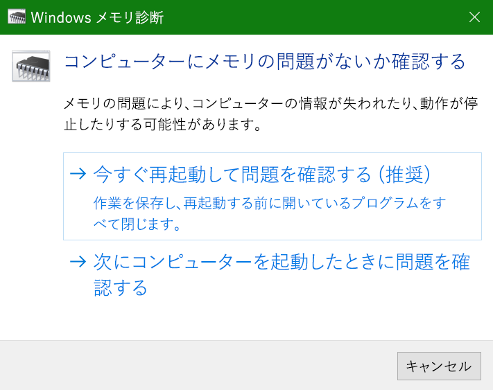

# Windows 10 の Windows メモリ診断を実行する

PC の Windows およびアプリがクラッシュしたり、フリーズしたり動作が不安定になったりする場合、PC のメモリ (RAM) に問題がある可能性があります。 Windows メモリ診断を実行して、PC の RAM に問題があるかどうかを確認できます。

タスクバーの検索ボックスに **「メモリ診断」** と入力し、**[Windows メモリ診断]** を選択します。 

診断を実行するには、PC の再起動が必要です。 すぐに再起動するか、(作業内容を保存して、開いているドキュメントと電子メールを先に終了します)。または、次回 PC が再起動したときに自動的に実行されるように診断をスケジュールすることができます。

PC が再起動すると、**Windows メモリ診断ツール** が自動的に実行されます。 診断実行時に状態と進捗状況が表示されます。また、使用しているキーボードの **ESC** キーを押して診断をキャンセルすることもできます。

診断が完了すると、Windows は正常に起動します。
再起動した直後にデスクトップが表示されると、(**アクションセンター** のタスク センターのアイコンの横) メモリ エラーが検出されたかどうかを示す通知が表示されます。 例:

アクション センターのアイコン:  

通知のサンプル: 

通知を見逃した場合は、タスクバーの **[アクション センター]** アイコンを選択 し、**アクション センター** を表示して スクロール可能な通知の一覧を表示することができます。

詳細情報を確認するには、タスクバーの検索ボックスに **「イベント」** と入力して、**[イベントビューアー]** を選択します。 **イベントビューアー** の左側のウィンドウで、**[Windows ログ]、[ システム]** に移動 ます。 右側のウィンドウで、Source 値 **"MemoryDiagnostics-結果"** のイベントが表示されるまで **[ソース]** 列を見ながら一覧を下にスキャンします。 それぞれのイベントを強調表示し、一覧の下にある **[全般]** タブ の下のボックスに結果情報を表示します。
